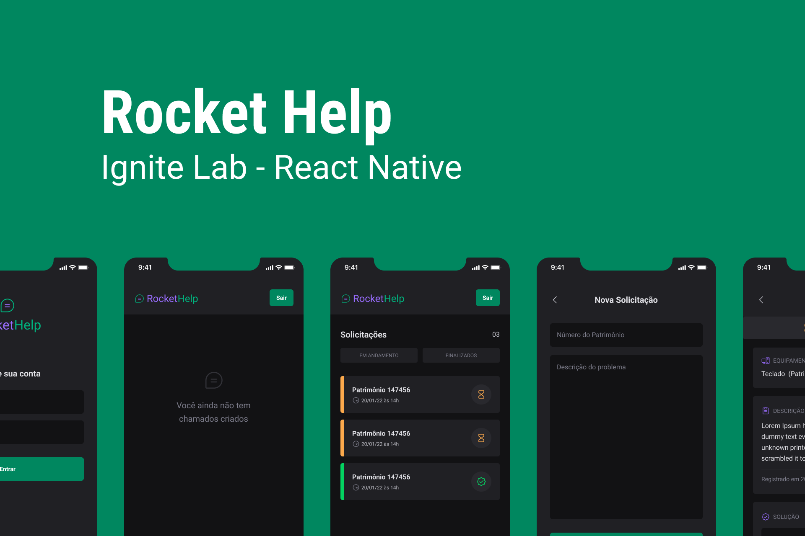

# Rocket Help (Aplicativo para resoluções de problemas)
Desenvolvido durante o Ignite Lab (Rocketseat)

## Capa
 <br/> <br/>

## Design da aplicação
- Clique [aqui](https://www.figma.com/file/Y7MS3KWqBIUfs9SKPtDdFf/Rocket-Help---Ignite-Lab-(Community)?node-id=37%3A6) para acessar o layout no Figma

## Funcionalidades da aplicação
- Login
- Cadastrar Solicitação
- Cadastrar soluçao do problema 
- Definir solicitação como finalizada

## Tecnologias utilizadas
- React Native
- Native Base
- Firebase
- React Navigation

## Como executar a aplicação 

### Instalação
1. Clone o repositório
```bash
git clone https://github.com/FixRuan/Rocket-Help
```
2. Acesse a pasta do projeto
```bash
cd Rocket-Help
```
3. Instale as dependências necessárias 
```bash
yarn
```
4. Execute o projeto
```bash
expo run:android
```
